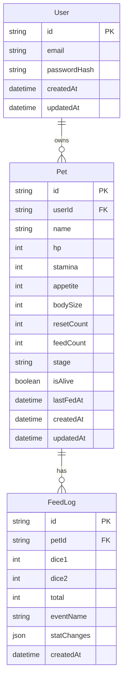

# 🗄️ 資料庫設計

## ER 圖

## 說明

### User
- `id`: UUID
- `email`: 唯一，用於登入
- `passwordHash`: bcrypt hash

### Pet
- `resetCount`: 重置次數，最大 5，到達上限後禁止重置
- `feedCount`: 累計餵食次數，用於判斷成長階段
- `stage`: egg / infant / growing / mature / elder
- `isAlive`: false 時顯示死亡頁面
- `lastFedAt`: 用於計算衰退

### FeedLog
- 記錄每次餵食的骰子結果與屬性變化
- `statChanges`: JSON，例如 `{"hp": 3, "stamina": 2}`
